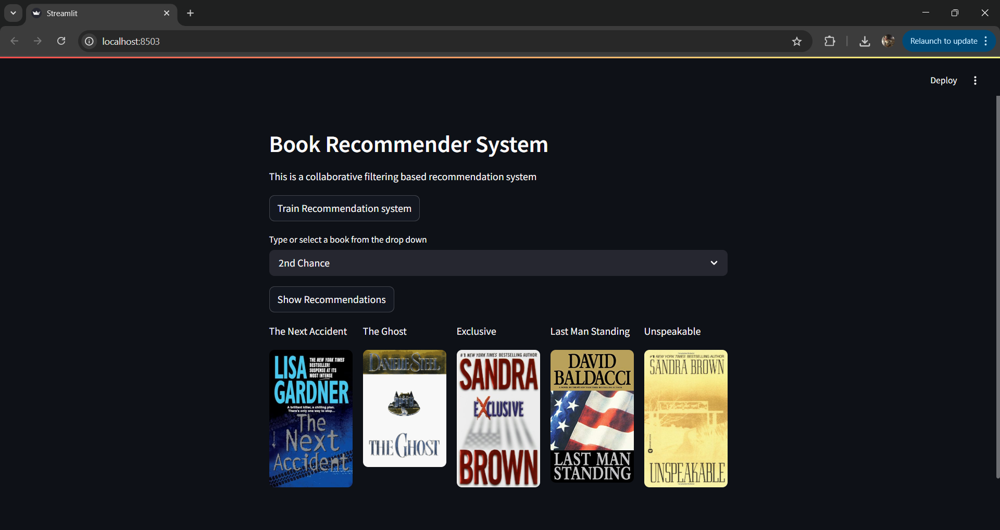
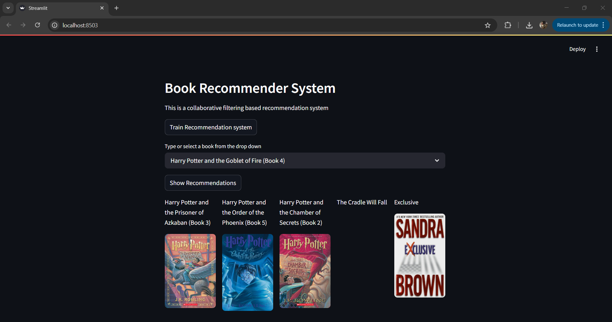

# 📚 End-to-End Book Recommender System
An interactive, Streamlit-powered machine learning application that recommends books based on user selection. This end-to-end project demonstrates data preprocessing, collaborative filtering, model training, deployment with Docker, and cloud hosting on AWS EC2.


---

## 🚀 Project Overview

This application allows users to select a book title and receive five personalized recommendations based on a hybrid recommendation system. The system uses collaborative filtering and cosine similarity to make intelligent recommendations.

### 🧠 Key Highlights:
- Streamlit UI for easy user interaction
- Trained using book rating datasets
- Hybrid model combining popularity and collaborative filtering
- Dockerized for containerized deployment
- Deployed and tested on AWS EC2

---


## 📂 Project Structure


```bash
End-to-End-Book-Recommender-System/
│
├── books_recommender/         # Core modules (pipeline, entity, components, config)
├── notebook/                  # Jupyter notebooks for EDA and development
├── templates/                 # Pickle files (book_names.pkl, model.pkl, final_rating.pkl)
├── app.py                     # Main Streamlit application
├── Dockerfile                 # Docker configuration for containerization
├── requirements.txt           # Python dependencies
└── README.md                  # Project documentation
```


## 🧰 Technologies Used:

Python 3.7
Pandas
NumPy 
Scikit-learn
Streamlit for web interface
Docker for containerization
AWS EC2 for deployment
Pickle for model serialization


## 🧪 How It Works:

1.Data Preprocessing: Ratings and metadata are merged and cleaned.

2.Model Training:
    Collaborative filtering using pivot tables and cosine similarity.
    Popular books filtering for a hybrid effect.

3.Serialization: Model artifacts saved as .pkl files.

4.Streamlit App:
    User selects a book from dropdown.
    The system displays 5 recommended books.

5.Deployment: Packaged with Docker and deployed on AWS EC2.


## 📸 UI Snapshot
The app features a dropdown to choose a book and displays five recommended titles along with relevant metadata.





## ⚙️ Running Locally
```bash
1. Clone the repo
    git clone https://github.com/SunilBilgunde/End-to-End-Book-Recommender-system.git
    cd End-to-End-Book-Recommender-system


2. Create and activate virtual environment
    python3.7 -m venv venv
    source venv/bin/activate  # On Windows: venv\Scripts\activate

3. Install dependencies
    pip install -r requirements.txt

4. Run the Streamlit app
    streamlit run app.py
```


## 🐳 Running with Docker
```bash
1. Build Docker image
    docker build -t book-recommender:latest .

2. Run the container
    docker run -p 8503:8503 book-recommender:latest

```

## 🤝 Author
## Sunil Bilgunde

